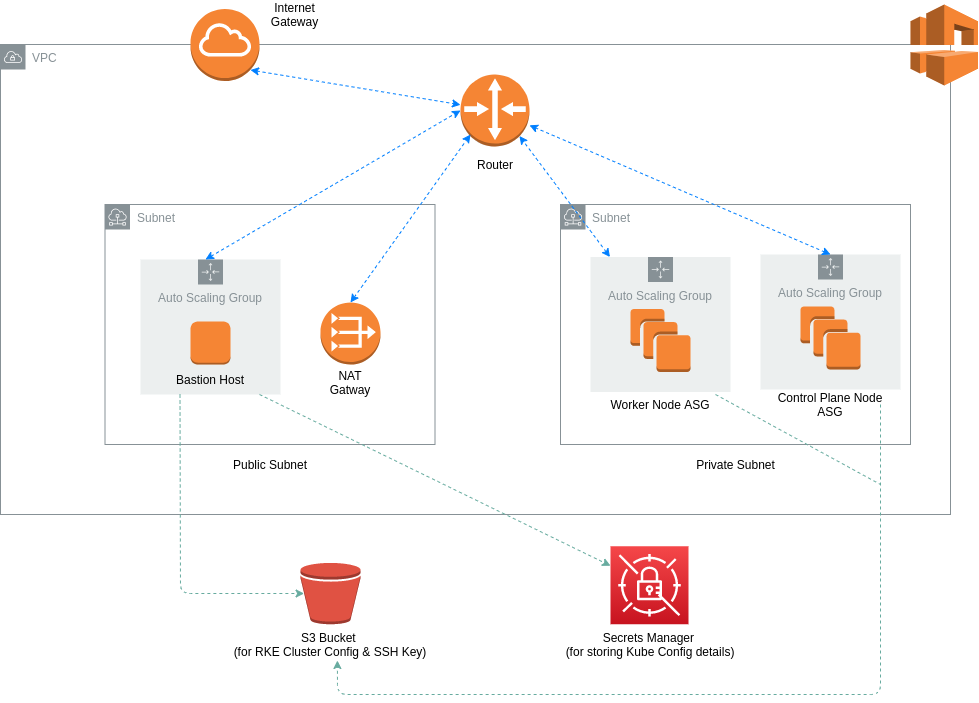
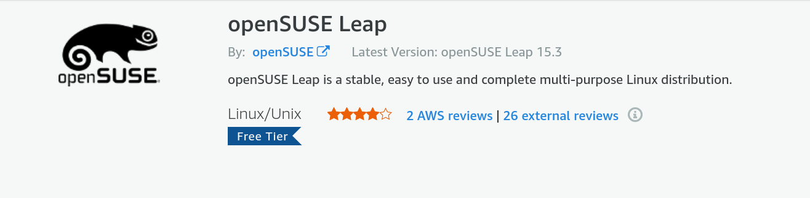

# RKE Kubernetes Cluster no ambiente AWS

Este repositório contém o código-fonte para inicializar um cluster RKE Kubernetes na AWS com um único comando, desde que você tenha atendido a todos os pré-requisitos e seguido as etapas de configuração inicial.


## Visão geral da arquitetura

O diagrama abaixo descreve a arquitetura geral para a rede VPC e os grupos de Auto Scaling que são usados para o cluster RKE Kubernetes.



## Pré-requisitos
* Conta AWS
* Perfil da AWS configurado com CLI na máquina local
* [Terraform](https://www.terraform.io/downloads.html)
* [Terragrunt](https://terragrunt.gruntwork.io/docs/getting-started/install/)
* Compreensão de como funciona o Rancher Kubernetes Engine (RKE).

## Estrutura do Projeto
```
├── README.md
├── infra-live
|  └── dev
├── infra-modules
|  └── app-environment
├── rke-cluster-config
|  └── cluster.yml
├── sensitive.tfvars (não committed pelo Git repo)
└── terragrunt.hcl
```

## Configuração inicial

Antes de executar o comando de provisionamento, certifique-se de seguir estas etapas iniciais.

*Este projeto usa o Terragrunt, que é um wrapper para o Terraform para tornar o código do Terraform mais [DRY](https://terragrunt.gruntwork.io/docs/features/keep-your-terraform-code-dry/) e fácil de reutilizar para vários ambientes. 

Os comandos do Terragrunt são semelhantes aos comandos do Terraform (ou seja, em vez de `terraform apply` execute `terragrunt apply`).*

### Configuração do cluster RKE

Crie um bucket do S3 que será usado para armazenar a configuração do cluster do seu cluster RKE K8s.

```aws s3api create-bucket --bucket <bucket-name> --region <region> --create-bucket-configuration LocationConstraint=<region>```

Um exemplo do arquivo de configuração do cluster pode ser encontrado no diretório `rke-cluster-config`. 

Certifique-se de *NÃO* preencher a propriedade de nós, isso será tratado automaticamente pelos scripts nos dados do usuário durante o processo de provisionamento de infraestrutura. 

Depois de finalizar o arquivo cluster.yml, carregue-o no bucket do S3 que você acabou de criar.

```
aws s3 cp ./cluster.yml s3://your-rke-cluster-config-bucket
```

### Chave SSH para nós de cluster

Crie uma chave SSH que será usada para estabelecer conexões com os nós em seu cluster. 

Você pode fazer isso no Console AWS na seção EC2. 

Após a criação, o arquivo *.pem* será baixado automaticamente. 

Você pode enviar este arquivo para `your-rke-cluster-config-bucket`.

```
aws s3 cp ./ec2-ssh-key.pem s3://your-rke-cluster-config-bucket
```

*Anote o nome que você dá a esta chave SSH porque você precisará fornecê-la como um valor de variável no arquivo sensitive.tfvars posteriormente.*

### Assine o openSUSE Leap no AWS Marketplace

Os nós neste projeto são provisionados com o openSUSE Leap 15.2. 

Para usar este sistema operacional, você precisa se inscrever nele [aqui](https://aws.amazon.com/marketplace/pp/prodview-wn2xje27ui45o). 

Você precisará estar conectado à conta da AWS que usará para provisionar essa infraestrutura. Ele está disponível para o *nível gratuito* na AWS.



### Configuração do estado de back-end remoto

Para configurar o estado de back-end remoto para sua infraestrutura, crie um bucket do S3 e uma tabela do DynamoDB antes de executar *terragrunt init*. 

Você pode preencher o arquivo de configuração pai do terragrunt (terragrunt.hcl) no diretório raiz com seus respectivos valores para o nome do bucket (your-terraform-state-bucket) e o nome da tabela (your-terraform-lock-table). 

Nesse mesmo arquivo de configuração, você pode atualizar a região e o nome do perfil aws.

#### Criar bucket do S3 para back-end de estado

```aws s3api create-bucket --bucket <bucket-name> --region <region> --create-bucket-configuration LocationConstraint=<region>```

#### Criar tabela do DynamoDB para State Locking

```aws dynamodb create-table --table-name <table-name> --attribute-definitions AttributeName=LockID,AttributeType=S --key-schema AttributeName=LockID,KeyType=HASH --provisioned-throughput ReadCapacityUnits=1,WriteCapacityUnits=1```

### Crie o arquivo `sensitive.tfvars`

Seus arquivos terragrunt conig files (`infra-life/dev/app-environment/terragrunt.hcl`) são configurados para ler qualquer valor de variável sensível de um arquivo chamado `sensitive.tfvars` no diretório raiz. 

Este arquivo não está committed com o repositório Git. 

O conteúdo do arquivo pode ser o seguinte:

```
profile="k8s-deployer"
region="us-east-1"
cluster_name="my-rke-cluster"
key_name="my-ec2-ssh-key" 
```

## Infraestrutura de provisionamento e cluster RKE

Depois de concluir todas as etapas acima na configuração inicial, redirecione para o diretório `infra-live/dev/app-environment` e execute os seguintes comandos:

```
terragrunt init
terragrunt plan
terragrunt apply -auto-approve
```

Para criar a infraestrutura para ambientes separados, crie pastas separadas em `infra-live` como `infra-live/test/app-environment` e `infra-live/prod/app-environment` com o mesmo arquivo terragrunt.tf localizado em `infra-live/dev/app-environment`.

Modifique o bloco de entrada do arquivo de configuração do Terragrunt para outros ambientes para o nome relevante:

### Dev
```
inputs = {
  environment    = "dev"
}
```
### Test
```
inputs = {
  environment    = "test"
}
```
### Prod
```
inputs = {
  environment    = "prod"
}
```

*Lembre-se de atualizar o nome do segredo ao criar a infraestrutura para ambientes adicionais.*

Para destruir a infraestrutura, execute o comando `terrargunt destroy` no mesmo local.

## Como tudo funciona?

### Etapas automatizadas

1. A VPC é provisionada pelo Terraform.
2. Os nós do plano de controle são provisionados pelo Terraform. O script userdata prepara o(s) nó(s) (ou seja, instalação de software e etapas de configuração do nó), baixa o arquivo cluster.yml do seu bucket e o atualiza com os detalhes do nó para cada nó no plano de controle e, em seguida, carrega-o de volta para o balde.
3. Os nós do Workers são provisionados pelo Terraform. O script userdata prepara os nós de forma semelhante aos nós do plano de controle, faz download do arquivo cluster.yml do seu bucket e o atualiza com os detalhes do nó para cada nó no grupo de nós do Workers e, em seguida, carrega-o de volta no bucket.
4. Os hosts Bastion são provisionados pelo Terraform. O script userdata instala a AWS CLI, a ferramenta RKE CLI e o kubectl. O arquivo cluster.yml e a chave SSH para os nós são baixados para o Bastion Host. O comando de provisionamento RKE é executado referenciando o arquivo cluster.yml e a chave SSH armazenada localmente na máquina.
5. Depois que o cluster RKE for provisionado, os detalhes da configuração do cluster serão salvos no Secrets Manager.

### Etapas manuais

1. SSH em seu host bastion usando a chave relevante.
2. Copie os detalhes de configuração do cluster RKE para o diretório de configuração kube dos hosts bastiões do Secrets Manager
```
mkdir -p $HOME/.kube

KUBE_CONFIG=$(sudo aws secretsmanager get-secret-value --secret-id rkekubeconfig --version-stage AWSCURRENT --region us-east-1 | jq -r .SecretString)

sudo tee $HOME/.kube/config<<EOF
$KUBE_CONFIG
EOF
```
3. Comece a implantar aplicativos em seu cluster Kubernetes!

## Problemas conhecidos

O plug-in do provedor aws usado neste projeto tem um problema que produz um plano inconsistente que pode atrapalhar o processo de provisionamento após a execução do comando `apply` relevante. 

No caso de você encontrar isso, você pode simplesmente executar novamente o comando de execução (`terragrunt apply`) e o processo continuará de onde parou.

